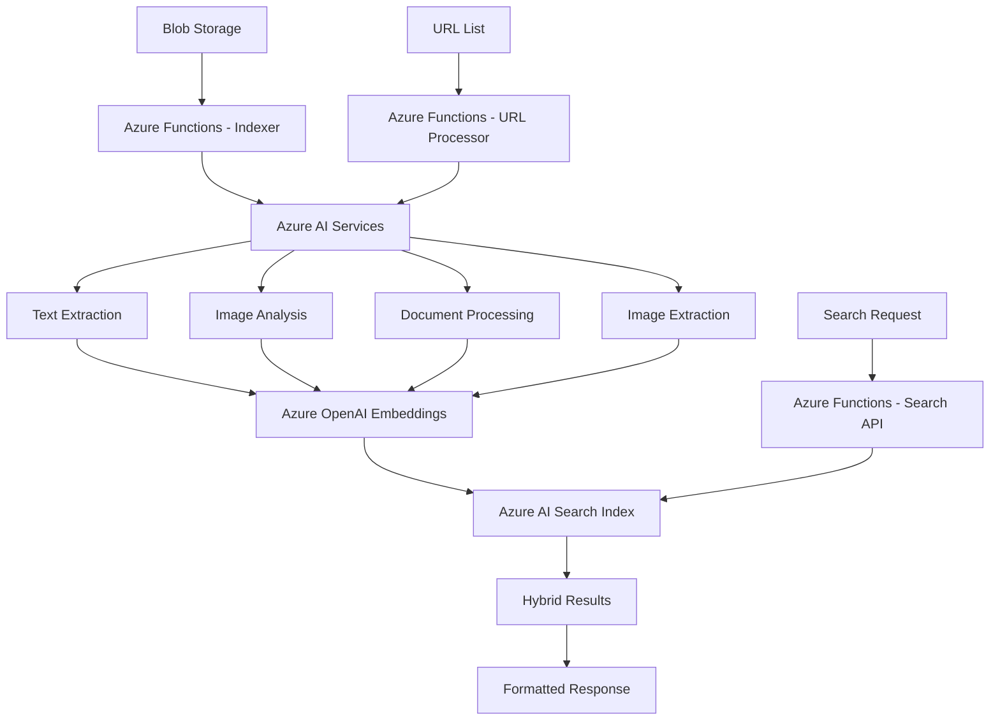

# RAG Search Requirements

## 🎯 Overview

The **RagSearch** system will implement a comprehensive Retrieval-Augmented Generation (RAG) search solution that indexes content from Azure Storage blob containers and provides intelligent search capabilities using both keyword and vector-based search methods.

## 📋 Core Requirements

### 1. **Data Indexing**
- **Source**: Azure Storage Account blob containers and web URLs
- **Content Types**: Support text documents (PDF, Word, PowerPoint), images, and web content
- **Processing**: Use Azure AI Services for content extraction and analysis
- **Index Storage**: **Azure AI Search service for persistent, durable searchable index** (NOT in-memory)
- **Vector Embeddings**: Generate embeddings for semantic search capabilities stored in Azure AI Search
- **Image Extraction**: Extract embedded images from source documents for separate indexing
- **Data Persistence**: All indexed content, metadata, and embeddings persisted in Azure AI Search
- **Scalability**: Index can grow to handle millions of documents with consistent performance

### 2. **Search Capabilities**

#### Search Methods
- ✅ **Keyword Search**: Traditional text-based search using keywords and phrases
- ✅ **Vector Search**: Semantic search using vector embeddings for meaning-based results
- ✅ **Hybrid Search**: Combine both keyword and vector search for optimal results

#### Content Types
- ✅ **Text Results**: Documents, PDFs, Word documents, PowerPoint presentations, text files, web pages
- ✅ **Image Results**: Photos, diagrams, charts, visual content, extracted document images
- ✅ **Mixed Results**: Return both text and image results in a unified response

### 3. **Response Structure**
Each search result must include:

```json
{
  "score": 0.95,
  "type": "text|image|document",
  "summary": "Brief description of the content",
  "url": "https://storage.blob.core.windows.net/container/file.pdf",
  "content": {
    "text": "Extracted or processed text content",
    "metadata": {
      "title": "Document title",
      "author": "Content author",
      "created": "2025-08-30T10:00:00Z",
      "fileSize": 1024576,
      "contentType": "application/pdf"
    }
  }
}
```

## 🏗️ Technical Architecture

### Azure Services Required

| Service | Purpose | Functionality |
|---------|---------|---------------|
| **Azure Storage Account** | Data Source | Blob container with documents and images |
| **Azure AI Search** | **Persistent Search Engine** | **Durable indexing, keyword search, vector search (Standard tier minimum)** |
| **Azure AI Services** | Content Processing | Text extraction, OCR, image analysis, document processing |
| **Azure OpenAI** | Embeddings | Generate vector embeddings for semantic search |
| **Azure Functions** | Processing Logic | Indexing pipeline, URL processing, and search API |

### Infrastructure Requirements

#### Azure AI Search Configuration
- **Service Tier**: Standard or higher (Basic minimum for production)
- **Storage**: All indexes stored on persistent SSD storage
- **Replicas**: 2+ replicas for high availability
- **Partitions**: Scale based on data volume (start with 1, scale up as needed)
- **Vector Search**: Enable vector search capabilities for semantic search
- **Backup**: Automatic backup enabled with 30-day retention minimum

### Data Flow



## 🔧 Implementation Components

### 1. **Blob Indexer Function** (Timer Trigger)
- **Trigger**: Scheduled execution (e.g., every hour)
- **Purpose**: Scan blob storage for new or updated files
- **Processing**: 
  - Detect new/modified blobs
  - Extract content using Azure AI Services
  - Generate embeddings using Azure OpenAI
  - Index content in Azure AI Search

### 2. **Real-time Indexer Function** (Blob Trigger)
- **Trigger**: Blob creation/modification events
- **Purpose**: Immediate indexing of new content
- **Processing**: Process individual files as they're added

### 3. **URL Processor Function** (HTTP/Queue Trigger)
- **Trigger**: HTTP requests with URL lists or queue messages
- **Purpose**: Process and index content from web URLs
- **Processing**:
  - Accept list of URLs to process
  - Download and extract content from web pages
  - Process PDF, Word, and PowerPoint files from URLs
  - Extract embedded images from documents
  - Generate embeddings and index content

### 4. **Search API Function** (HTTP Trigger)
- **Trigger**: HTTP requests
- **Purpose**: Handle search queries
- **Processing**:
  - Accept search parameters
  - Execute hybrid search (keyword + vector)
  - Format and return results

### 5. **Content Processing Pipeline**
- **Document Processing**: PDF, Word (.docx), PowerPoint (.pptx), text files
- **Image Processing**: OCR, image captioning, object detection
- **Image Extraction**: Extract embedded images from PDF, Word, and PowerPoint documents
- **Web Content Processing**: HTML parsing, downloadable document handling
- **Metadata Extraction**: File properties, creation dates, authors, source URLs

## 📊 Search Features

### Query Types

#### 1. **Keyword Search**
```http
POST /api/search
{
  "query": "azure functions deployment",
  "searchType": "keyword",
  "contentTypes": ["text", "image"],
  "maxResults": 10
}
```

#### 2. **Vector Search**
```http
POST /api/search
{
  "query": "how to deploy serverless applications",
  "searchType": "vector",
  "contentTypes": ["text"],
  "maxResults": 10
}
```

#### 3. **Hybrid Search**
```http
POST /api/search
{
  "query": "azure container deployment best practices",
  "searchType": "hybrid",
  "contentTypes": ["text", "image"],
  "maxResults": 20,
  "filters": {
    "fileType": "pdf",
    "dateRange": {
      "from": "2025-01-01",
      "to": "2025-08-30"
    }
  }
}
```

#### 4. **URL Processing**
```http
POST /api/index/urls
{
  "urls": [
    "https://example.com/document.pdf",
    "https://example.com/presentation.pptx",
    "https://example.com/article.html"
  ],
  "options": {
    "extractImages": true,
    "processEmbeddedContent": true,
    "generateThumbnails": true
  }
}
```

### Advanced Features

#### Filtering Options
- **File Type**: PDF, Word (.docx), PowerPoint (.pptx), images, text files, web pages
- **Date Range**: Created/modified date filtering
- **Content Type**: Text-only, images-only, or mixed
- **Source Container**: Specific blob containers or URL domains
- **File Size**: Size-based filtering
- **Source Type**: Blob storage vs. web URLs

#### Scoring and Ranking
- **Relevance Score**: Combined keyword and semantic relevance
- **Content Quality**: Based on content structure and completeness
- **Recency Boost**: Newer content gets slight preference
- **Authority Score**: Based on source and metadata quality

## 🔍 Content Types Support

### Text Documents
- **PDF Files**: Full text extraction with OCR for scanned documents, embedded image extraction
- **Microsoft Office**: Word (.docx), PowerPoint (.pptx), Excel (.xlsx) documents with embedded content
- **Text Files**: Plain text, Markdown, CSV files
- **Web Content**: HTML pages, XML documents, downloadable PDFs and Office files

### Images
- **Standalone Images**: Direct image files (JPEG, PNG, GIF, etc.)
- **Extracted Images**: Images embedded within PDF, Word, and PowerPoint documents
- **OCR Processing**: Extract text from images and scanned documents
- **Image Description**: AI-generated descriptions and captions
- **Object Detection**: Identify objects and concepts within images
- **Scene Analysis**: Understand image context and relationships

### Metadata Enrichment
- **File Properties**: Name, size, creation date, modification date
- **Content Analysis**: Language detection, key phrases, sentiment
- **Custom Tags**: User-defined or AI-suggested tags
- **Relationship Mapping**: Link related documents

## 🚀 API Endpoints

### Search Endpoint
```
POST /api/search
GET /api/search?q={query}&type={searchType}&content={contentTypes}
```

### Index Management
```
POST /api/index/rebuild        # Rebuild entire index
POST /api/index/update         # Update specific documents
POST /api/index/urls           # Process and index URLs
GET /api/index/status          # Get indexing status
DELETE /api/index/{documentId} # Remove document from index
```

### Analytics
```
GET /api/analytics/search-stats    # Search usage statistics
GET /api/analytics/content-stats   # Content analysis statistics
GET /api/analytics/performance     # Search performance metrics
```

## 📈 Performance Requirements

### Index Persistence Requirements
- **Durability**: All indexed data must survive service restarts and deployments
- **Azure AI Search Service**: Use dedicated Azure AI Search service (Standard or Basic tier minimum)
- **No In-Memory Storage**: All search indexes, vector embeddings, and metadata persisted to disk
- **Backup and Recovery**: Azure AI Search provides automatic backup and point-in-time recovery
- **Cross-Region Availability**: Option to replicate index across Azure regions for disaster recovery
- **Index Versioning**: Support for index schema updates without data loss

### Search Performance
- **Response Time**: < 500ms for typical queries
- **Throughput**: Support 100+ concurrent search requests
- **Availability**: 99.9% uptime target

### Indexing Performance
- **Processing Speed**: 100+ documents per minute
- **Batch Processing**: Handle large document sets efficiently
- **Real-time Updates**: Index new content within 5 minutes

## 🔒 Security Considerations

### Access Control
- **Authentication**: Azure AD integration for user authentication
- **Authorization**: Role-based access to search results
- **Data Privacy**: Respect document-level permissions

### Content Security
- **Data Encryption**: Encrypt data at rest and in transit
- **Content Filtering**: Block sensitive or inappropriate content
- **Audit Logging**: Track search queries and access patterns

## 🧪 Testing Strategy

### Unit Testing
- **Search Logic**: Test search algorithms and ranking
- **Content Processing**: Test extraction and indexing
- **API Endpoints**: Test all search and management endpoints

### Integration Testing
- **End-to-End Search**: Full search workflow testing
- **Performance Testing**: Load testing with realistic data
- **Content Processing**: Test with various file types

### PowerShell Testing Scripts
- **Index Health Check**: Verify index status and content
- **Search Validation**: Test search accuracy and performance
- **Content Processing**: Validate extraction and indexing

## 📋 Implementation Phases

### Phase 1: Foundation (Week 1-2)
- ✅ Set up Azure AI Search service
- ✅ Configure Azure AI Services
- ✅ Create basic indexing function
- ✅ Implement simple keyword search

### Phase 2: Content Processing (Week 3-4)
- ✅ Add document processing pipeline for PDF, Word, PowerPoint
- ✅ Implement image analysis and OCR
- ✅ Create embedded image extraction from documents
- ✅ Add URL processing functionality
- ✅ Create metadata extraction
- ✅ Add content validation

### Phase 3: Vector Search (Week 5-6)
- ✅ Integrate Azure OpenAI for embeddings
- ✅ Implement vector search capabilities
- ✅ Create hybrid search functionality
- ✅ Optimize search ranking

### Phase 4: Advanced Features (Week 7-8)
- ✅ Add filtering and faceting
- ✅ Implement real-time indexing
- ✅ Create analytics and monitoring
- ✅ Performance optimization

### Phase 5: Production Readiness (Week 9-10)
- ✅ Security implementation
- ✅ Comprehensive testing
- ✅ Documentation and training
- ✅ Deployment and monitoring

## 🎯 Success Criteria

### Functional Requirements
- ✅ Successfully index and search text and image content
- ✅ Provide accurate and relevant search results
- ✅ Support both keyword and semantic search
- ✅ Return structured results with required fields

### Performance Requirements
- ✅ Sub-second search response times
- ✅ Handle large document collections (10,000+ files)
- ✅ Support concurrent users (50+ simultaneous searches)
- ✅ Reliable indexing pipeline

### Quality Requirements
- ✅ High search relevance and accuracy
- ✅ Comprehensive content extraction
- ✅ Robust error handling and recovery
- ✅ Complete monitoring and observability

## 📚 Related Documentation

- [Overview](overview.md) - Project overview and architecture
- [Functions Reference](functions-reference.md) - Detailed function documentation
- [Copilot Instructions](copilot-instructions.md) - Development guidelines
- [Copilot Commands](copilot-commands.md) - Command reference
- [Azure AI Search Documentation](https://docs.microsoft.com/en-us/azure/search/)
- [Azure AI Services Documentation](https://docs.microsoft.com/en-us/azure/cognitive-services/)

---

*This document defines the comprehensive requirements for implementing intelligent search capabilities in the RagSearch Azure Functions project.*
